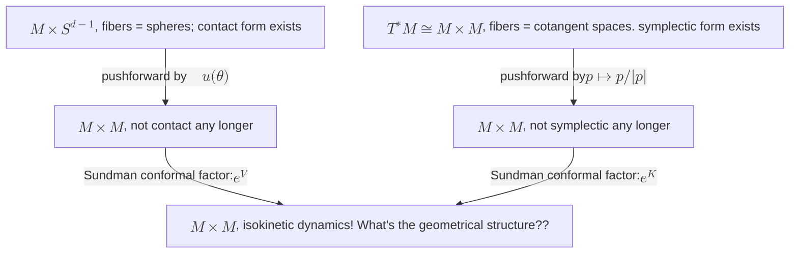

## Contact Geometry

!!! References

    https://arxiv.org/pdf/1604.08266

Contact geometry is a counterpart to symplectic geometry on odd-dimensional manifolds.

<!-- In symplectic geometry, we start with a $(2n)$-dim manifold equipped with a 1-form $\eta$ satisfying certain properties, and a scalar-valued function $H$ on the manifold, and derive a vector field on the manifold (section of the tangent bundle) which respects 
TODO

In contact geometry, we start with a $(2n+1)$-dim manifold equipped with a 1-form $\eta$ satisfying certain properties, and a scalar-valued function $H$ on the manifold, and derive a dynamics on the manifold which respects 
TODO
$H^{-n}\eta\wedge (d\eta)^{n-1}$. -->

It turns out that isokinetic dynamics can be formulated in the language of contact geometry.

### Key points

Working on an $(2n+1)$-dimensional manifold $\mathcal{M}$, one starts by providing a contact form, which is a 1-form $\eta$ satisfying $\eta\wedge (d\eta)^n \neq 0$, and a Hamiltonian $H : \mathcal{M} \to \mathbb{R}$.

Then the vector field $X_H$ is uniquely defined by:

$$
dH = i_{X_H}d\eta + \xi(H)\eta
$$

??? Derivation

    We start with the defining properties of the contact form, which are given:

    $$i_{X_H}\eta = -H$$ 

    and 

    $$\mathcal{L}_{X_H}\eta = f_H \eta$$

    for some $f_H$, where $\mathcal{L}$ is the Lie derivative.

    The Reeb vector field $\xi$ defined uniquely by $\eta(\xi) = 1$ and $d\eta(\xi)=\lambda k:0$. It can be shown that this implies:

    $$
    f_H = -\xi(H)
    $$

    so that, using Cartan's formula, we have

    $$
    dH = i_{X_H}d\eta - \mathcal{L}_{X_H}\eta
    $$

    $$
    = i_{X_H}d\eta + \xi(H)\eta
    $$

#### Contact invariant

$$
V := |H|^{-(n+1)}(\eta \wedge (d\eta)^n)
$$

is preserved under the flow of $X_H$.

### Isokinetic contact form

Take $\eta = u_i(\theta)dx^i$ and $H(x,u) = p(x)^{n}$. We then recover isokinetic dynamics, up to a Sundman transform.

To see this, first note that $d\eta = \frac{\partial u_i}{\partial \theta_\mu}d\theta_\mu\wedge dx^i$, by the normal definition of the exterior derivative. Further, to satisfy the defining condition of the Reeb vector field, we must have $\xi(z)=u^i\frac{\partial}{\partial x^i}$.

TODO: why is $d\eta(\xi)$ 0?

Then note that $V = |H|^{-(n+1)}dudx$

TODO: clarify this ^^^ - it seems off by a factor of $u$.

Using Cartan's formula ($\mathcal{L}_X\omega = di_X\omega + i_Xd\omega$), and the fundamental conditions of contact geometry, $\mathcal{L}_{X_H}\eta = -R(H)\eta$ and $\eta(X_H)=-H$, we have:

$$
d\eta(X_H) + dH = -R(H)\eta
$$

which we can put in $x,
\theta$ coordinates directly as:

$$
-\partial_\mu u_i d\theta^\mu X_H^i+ \partial_\mu u_i dx^i  X_H^\mu - \partial_\mu H d\theta^\mu - \partial_i H dx^i = -u_ju_i\partial_i H dx^j
$$

From this we see that 

$$
\partial_\mu u_i   X_H^\mu = (\delta_{ji}-u_ju_i)\partial_i H 
$$

Moreover, $\partial_\mu u_i   X_H^\mu$ is precisely the $\theta$ components of the $X_H$ vector field pushed forward into the $u$ coordinates, so we have

$$
\dot u = (\delta_{ji}-u_ju_i)\partial_i H 
$$

For $\dot x$, we use the condition $\eta(X_H)=u_idx^i = -H$ to solve and find $X_H^i(x,\theta) = -u^iH(x)$, so that

$$
\dot x = -uH
$$

From here, we perform a Sundman transform, with $a = -\frac{1}{H}$, to obtain the isokinetic dynamics.

### Geometric picture

As in the symplectic case, we are composing two transforms on the bundle, which commute with each other.

      

      

      
