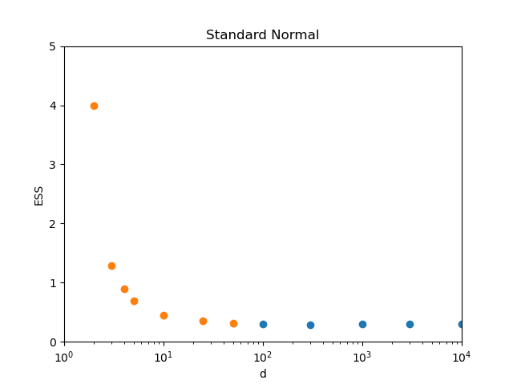

MCHMC conserves the energy, which in 1D is equal to:

$$
    E = \log \Pi(t) - \log p(x(t))
$$

so that

$$
    \Pi(t) \propto 1/p(x(t)).
$$

We will take the initial condition $x(0) = -\infty$ with the proportionality constant equals 1 in the above relation and periodic boundary conditions at infinity. The Hamilton's equation for the velocity gives $\dot{x} = 1/p(x(t)$, so for $0 \leq t \leq 1$:

$$
    t = \int_{-\infty}^{x(t)} p(x) dx = P(X < x(t))
$$

and the general solution is

$$
    x(t) = \mathrm{CDF}^{-1}(t \, \mathrm{mod} \, 1).
$$

With some $\epsilon$ stepsize in time, this is the improved inverse transform sampling[^1], where a random number generator was replaced by a low-discrepancy sequence[^2] generator, namely the additive recurrence. As such, it is very efficient and has $ESS > 1$. This property persists in dimensions $d = 2$ and $d = 3$ as is shown in Figure 1 with the standard Gaussian target in various dimensions.

[^1]: https://en.wikipedia.org/wiki/Inverse_transform_sampling
[^2]: https://en.wikipedia.org/wiki/Low-discrepancy_sequence
