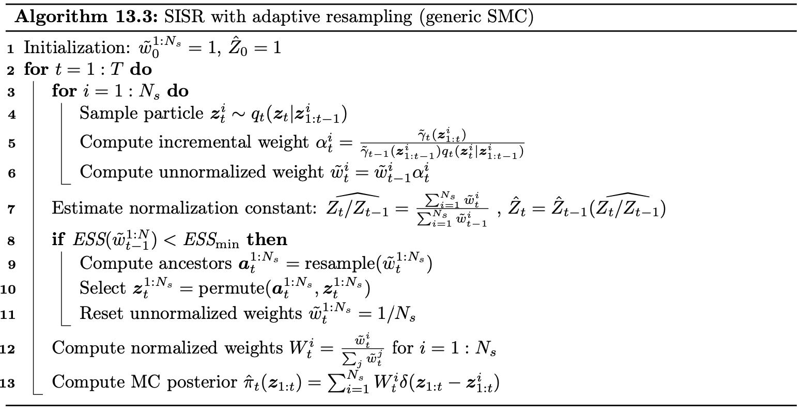

# Sequential Monte Carlo (SMC) samplers

See the  for surprisingly readable introductions to SMC.

!!! Note 

    SMC is sometimes used synonymously with *particle filtering*, an inference technique which extends importance sampling to sequential models (like state space models).

    The use of SMC here is indeed the same general thing, but is more specific: an approach to inference which requires the user to supply a series of distributions converging on the distribution of interest, and a clever use of an MCMC kernel to move between them. [Kevin Murphy's book](https://probml.github.io/pml-book/book2.html) uses the term *SMC samplers*.

**What an SMC sampler requires**:

1. A sequence of distribution $\pi_t := \gamma_t/Z_t$, with the target distribution at $t=n$ for some $n$. (For instance, $\pi_t(x) = e^{-\beta_t E(x)}$, where $T_t := \frac{1}{\beta_t}$ is a temperature being lowered).
2. Kernels $K_i(x|x')$ which have $\pi_t$ as a fixed point, from which we can sample. (For instance, MCMC kernels like MH or, more relevant here, MCLMC).

**What an SMC sampler delivers**:

A parallelizable sampler from $\pi_n$.
 
**The algorithm**:

(This is from [Kevin Murphy's book](https://probml.github.io/pml-book/book2.html), section 13.3)

In particular, we can compute $\alpha^i_t = \frac{\gamma_t(x^i_{t-1})}{\gamma_{t-1}(x^i_{t-1})}$. When the series of distributions is of the form $e^{-\beta_i H(x)}$, then $\log \alpha^i_t = (\beta_{t-1}-\beta_t)E(x_i)$, which in the [code](https://github.com/JakobRobnik/MicroCanonicalHMC/blob/master/sampling/smc.py) is `logw = -(beta - 1.0/Tprev) * l`.

<!-- ESS above refers to the *effective sample size*, which here is defined $ESS_t =: \frac{E_{\pi_t} [𝑤(𝜃)]^2}{E_{\pi_t} [𝑤(𝜃)^2]}$ -->

